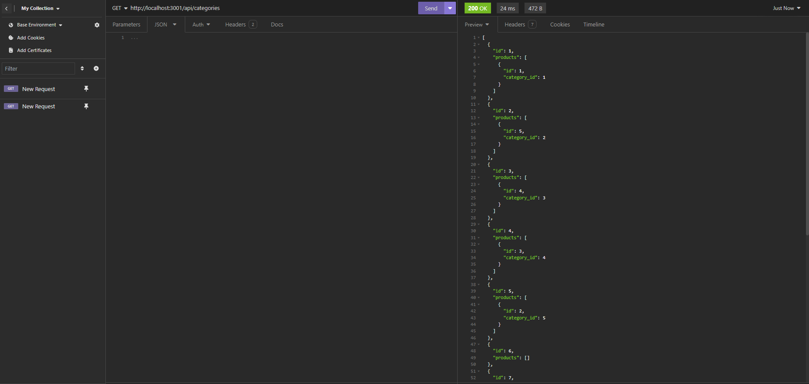
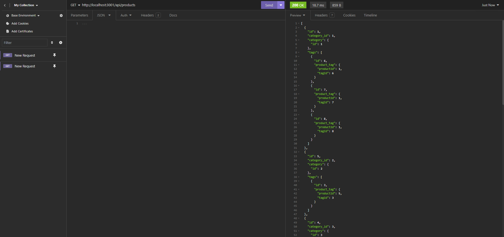

# Digital
## Description
The application is an e-commerce platform designed to facilitate the buying and selling of products online. It provides a user-friendly interface for both customers and administrators to interact with the platform.

## Table of Contents

* [Installation](#Installation)
* [Usage](#Usage)
* [Features](#Features)
* [Demo](#Demo)

## Installation

```md
npm i inquirer
npm i mysql2 
npm i sequelize
npm i dotenv
```
## Usage
```md
Node server.js
npm start
npm run seed
```
## Features

```md
JavaScript
ES6+
Node.js
MySQL
```
## Images

The following animation shows the application's GET routes to return all categories, all products, and all tags being tested in Insomnia:






## Demo 
For the demo video first it will download in your machine and then it will display.

Do you want to learn more about this program?[Please click here for a video demo](https://drive.google.com/uc?id=1IILEsBWSNFFdM_R-aWB4zvGqt5Hc4d_H&export=download)

[Please click here for insomnia](https://drive.google.com/uc?id=1-maZaIPkkq8m4m9SsmkTC-zbC4_oTLGb&export=download)