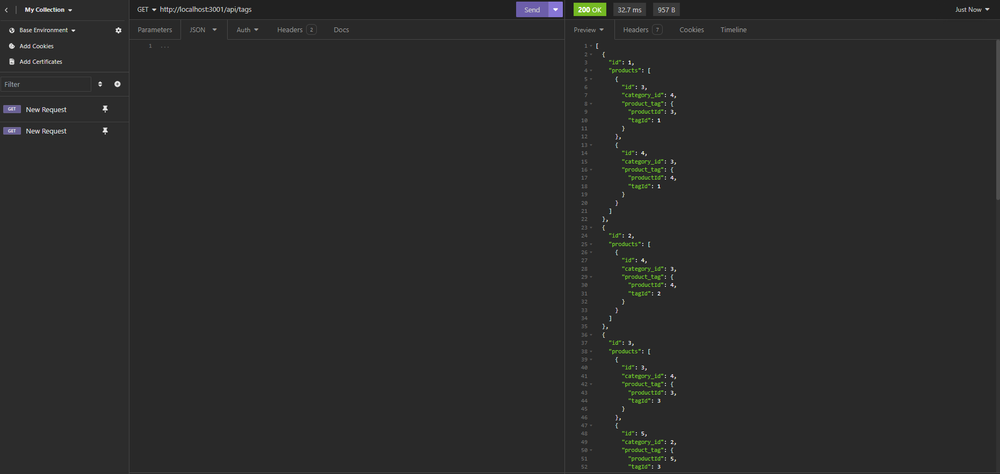

# Digital
## Description
The application is an e-commerce platform designed to facilitate the buying and selling of products online. It provides a user-friendly interface for both customers and administrators to interact with the platform.

## Table of Contents

* [Installation](#Installation)
* [Usage](#Usage)
* [Features](#Features)
* [Demo](#Demo)

## Installation

```md
npm i inquirer
npm i mysql2 
npm i sequelize
npm i dotenv
```
## Usage
```md
Node server.js
npm start
npm run seed
```
## Features

```md
JavaScript
ES6+
Node.js
MySQL
```
## Demo

The following animation shows the application's GET routes to return all categories, all products, and all tags being tested in Insomnia:




Do you want to learn more about this program?[Please click here for a video demo]